# 💸 AI Expense Tracker

A modern AI-powered Expense Tracker built using React, Node.js, Express.js, MongoDB Atlas, and JWT Authentication. The application provides real-time expense management, analytics dashboards, budget tracking, CSV report generation, and role-based access for Users and Admins.

✨ Highlights

✅ JWT Authentication & Authorization

✅ Role-Based Access Control (User & Admin)

✅ Expense Management (Add, Edit, Delete)

✅ Interactive Analytics Dashboard

✅ Budget Tracking System

✅ CSV Report Export

✅ User Profile Management

✅ Admin User Management

✅ Responsive Modern UI

✅ MongoDB Atlas Integration

✅ Protected Routes

✅ Real-Time Expense Insights


## 🚀 Key Features

### 🚀 Project Overview

The AI Expense Tracker helps users manage daily expenses efficiently while providing meaningful spending insights through analytics and reports.

### 👤 User Features

* Add Expenses
* Edit Expenses
* Delete Expenses
* Expense Analytics
* Budget Tracking
* Transaction History
* CSV Report Export
* Profile Management

### 🧑‍💼 Admin Features

* Dashboard Monitoring
* User Management
* Analytics Dashboard
* Report Generation
* Platform Statistics
* System Settings

## 📑 Table of Contents

* Features
* Screenshots
* Live Demo
* Tech Stack
* Architecture
* Installation
* Environment Variables
* API Endpoints
* Future Improvements
* Author

## 📸 Project Screenshots

### 🔐 Authentication

#### Login Page

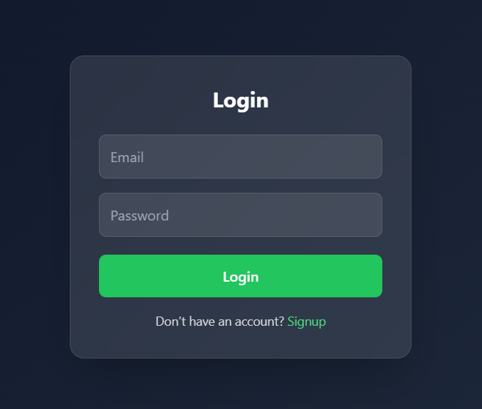

#### Signup Page

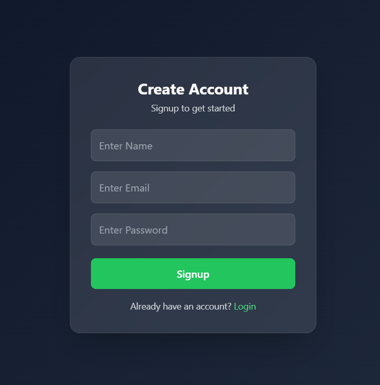

### 👤 User Dashboard

#### UserDashboard

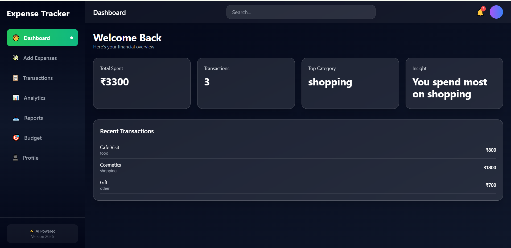

#### Add Expenses

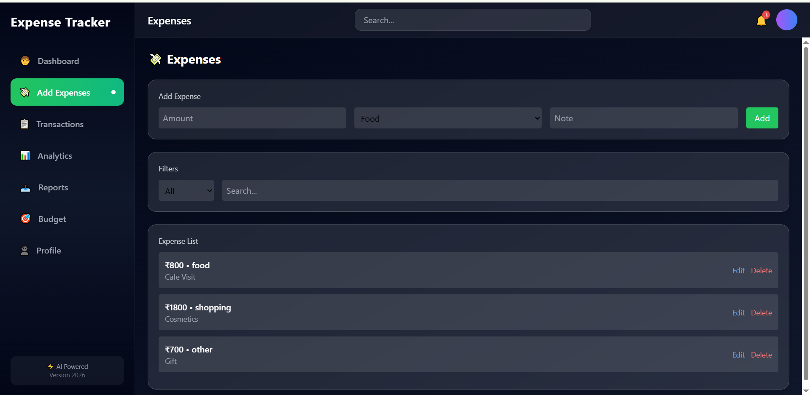

#### Transactions

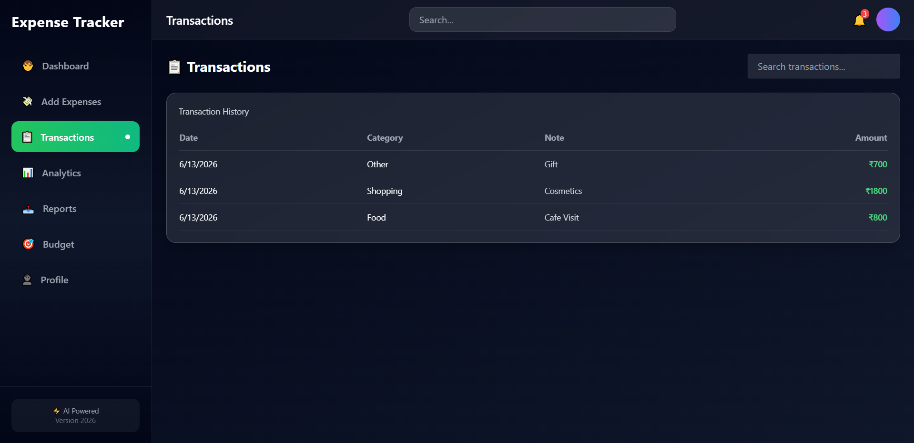

#### Budget Tracker

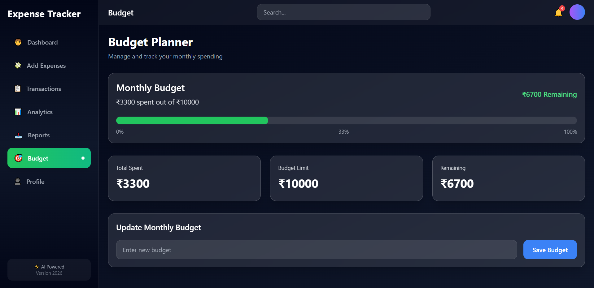

#### User Analytics

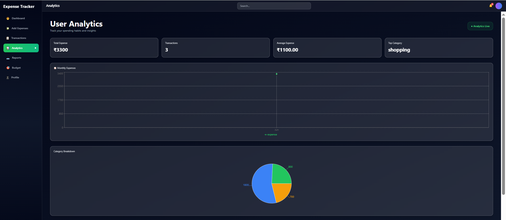

#### Profile

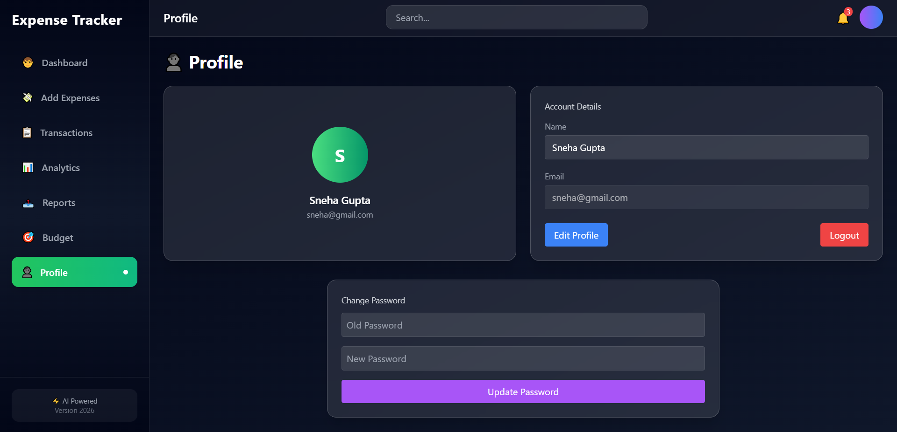

### 🧑 Admin Dashboard

### Dashboard

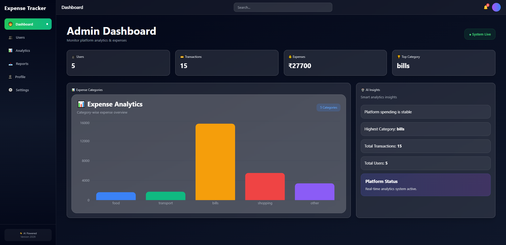

### User_Management

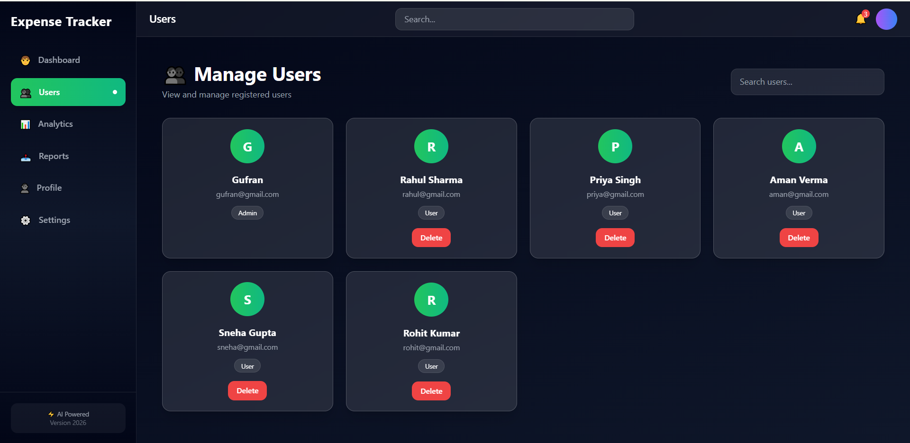

#### Analytics

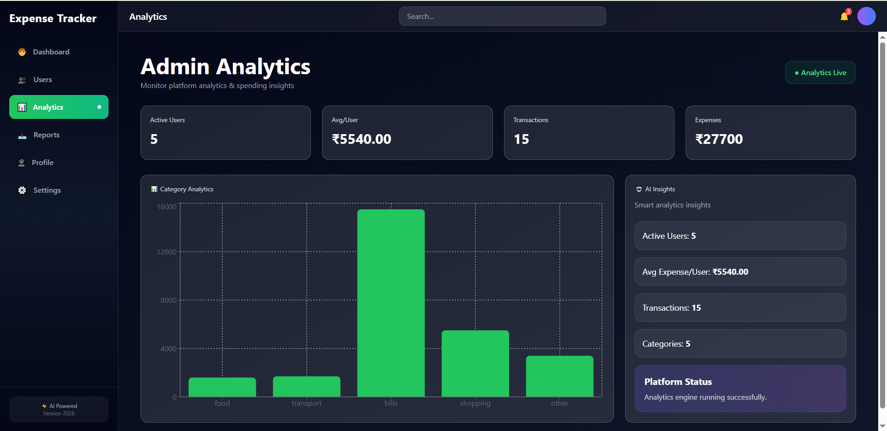

#### Reports

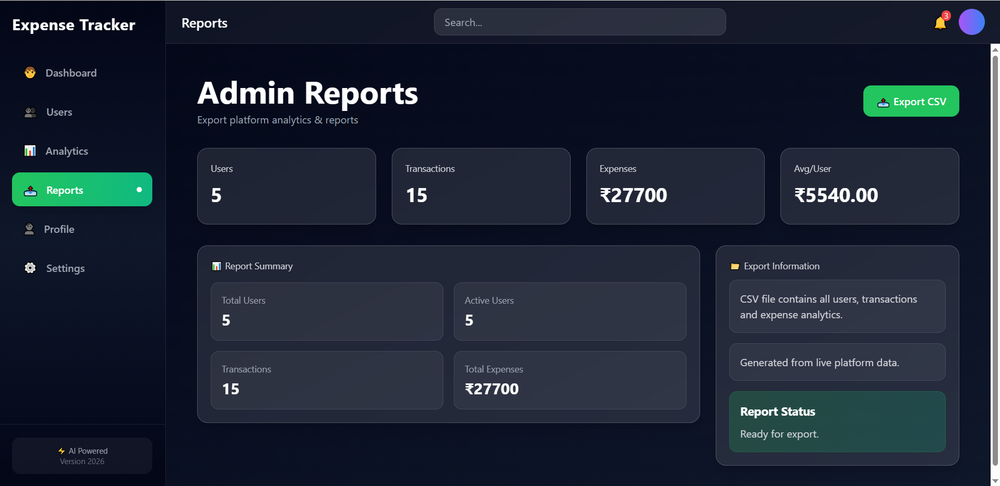

#### AdminProfile

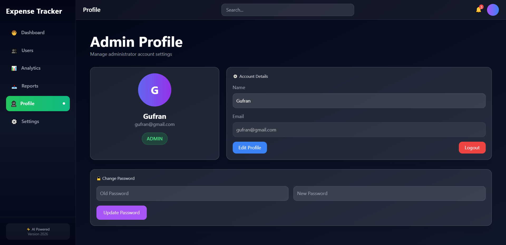

## 🌐 Live Demo

Frontend: 
<https://ai-expense-tracker-68bj.onrender.com>

Backend API:
<https://ai-expense-tracker-backend-rvb8.onrender.com>

## 🔗 Repository

GitHub Repository:
<https://github.com/Gufrankhan2327/ai_expense_tracker>

## 🛠️ Tech Stack

### 🎨 Frontend

* React.js (Vite)
* Tailwind CSS
* Axios
* Recharts

### ⚙️ Backend

* Node.js
* Express.js
* JWT Authentication

### 🗄️ Database

* MongoDB Atlas

## 🏗️ System Architecture

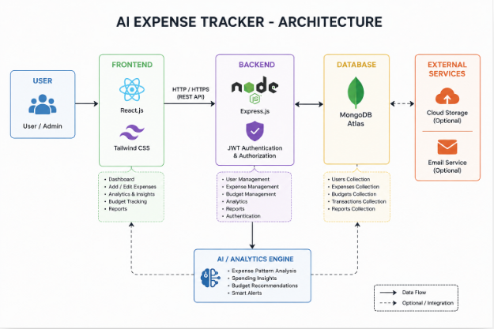

### Flow

User/Admin
    ↓
React Frontend (Vite + Tailwind)
    ↓
Express.js Backend API
    ↓
JWT Authentication
    ↓
MongoDB Atlas Database
    ↓
Analytics & Reports Engine

## 📁 Folder Structure

frontend/
└── src/
    ├── components/
    │   ├── layout/
    │   └── ui/
    ├── pages/
    │   ├── auth/
    │   ├── user/
    │   └── admin/
    ├── routes/
    ├── services/
    └── App.jsx

backend/
├── controllers/
├── middleware/
├── models/
├── routes/
├── config/
└── server.js

## 🗄️ Database Schema

### User

```js
{
  name: String,
  email: String,
  password: String,
  role: String
}
```

### Expense

```js
{
  amount: Number,
  category: String,
  note: String,
  userId: ObjectId,
  date: Date
}
```

## 🔒 Security Features

✅ JWT Authentication

✅ Protected Routes

✅ Role*Based Access Control

✅ Password Hashing

✅ Secure MongoDB Atlas Connection

✅ Environment Variable Protection

## ⚡ Performance Features

* Fast React UI
* Recharts Analytics
* Optimized API Calls
* Responsive Design
* MongoDB Indexing

## 🔐 Authentication Flow

Login → JWT Token → Protected Routes → Role Verification → User/Admin Dashboard

## ⚙️ Installation & Setup

### Clone Repository

bash
git clone <https://github.com/Gufrankhan2327/ai-expense-tracker.git>
cd ai-expense-tracker

### Backend Setup

bash
cd backend
npm install
nodemon server.js

### Frontend Setup

bash
cd frontend
npm install
npm run dev

## 🔑 Environment Variables

Create `.env` file in backend:
env
PORT=5000
MONGO_URI=your_mongodb_url
JWT_SECRET=your_secret_key

## 🧪 Demo Login

### 👤 User

* Email: <demo.user@example.com>
* Password: Demo@123

### 🧑‍💼 Admin

* Email: <demo.admin@example.com>
* Password: Admin@123

## 🌐 Deployment

| Part     | Platform      |
|----------|---------------|
| Frontend | Render        |
| Backend  | Render        |
| Database | MongoDB Atlas |

## 🔌 API Endpoints

### Auth

* POST /api/auth/login
* POST /api/auth/signup

### Expenses

* GET /api/expenses
* POST /api/expenses/add
* PUT /api/expenses/:id
* DELETE /api/expenses/:id

### UserAnalytics

* GET /api/analytics/user
* GET /api/admin/analytics

### User_

* GET /api/profile
* PUT /api/profile
* PUT /api/profile/password

### Admin

* GET /api/users
* DELETE /api/users/:id

### AdminReports

* GET /api/reports

### Budget

* GET /api/budget
* POST /api/budget

## 🚀 Future Improvements

* 🔔 Notification System
* 📱 Mobile App (React Native)
* 🤖 Advanced AI Insights
* 🌍 Multi-currency Support

## 🎯 Learning Outcomes

This project demonstrates:

* MERN Stack Development
* JWT Authentication
* Role-Based Access Control
* MongoDB Atlas Integration
* REST API Development
* Analytics Dashboard Development
* Responsive UI Design
* Deployment using Render

## 👨‍💻 Author

**Gufran Khan**
Full Stack Developer (MERN + AI)

## 📬 Contact

GitHub: <https://github.com/Gufrankhan2327>

Built with ❤️ by Gufran Khan

## ⭐ Show Your Support

If you like this project:

* ⭐ Star the repo
* 🔗 Share with others
* 💼 Use in your portfolio
